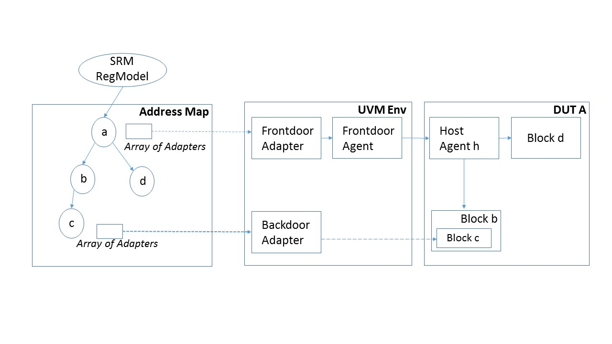

# Introduction
This is the top level directory of the simple reg model repository. The distrib directory will contain code that is intended for distribution.

## Simple Register Model
Simple Register Model (srm) are system verilog classes that help to develop register model (aka regstore, register abstraction layer) for uvm testbenches. It is open sourced and available under MIT license.

It is designed to be used in uvm testbenches instead of the *uvm_reg* package that is shipped with uvm distribution. 

The intended users of the package are design verificatipn (DV) engineers involved in developing uvm testbneches and writing uvm sequences for verifying the design.

A typical setup of a uvm testbench using srm register package is shown below in Figure 1. A srm register model of a chip consist of a register map as shown. The register model generates generic bus transactions that are sent to the appropriate adapter which forwards it to the bus specific agent.

## Limitations Of UVM Register Package

### A.	Large Memory Footprint
  UVM register package causes memory to be statically allocated for all the locations in the address map, independent of the actual locations accessed by the test. In fact, each register needs to be as large as the largest register in the design. It is well known that most tests, especially at the system level, access only a small fraction of the address space. Hence it is wasteful to pay for all the locations in each test.
  UVM register does provide a “vreg” lightweight api. This is just an access API with no storage inside the model intended for memories with their own custom model (like external memories). Hence this is not a valid solution for on chip structures.

 ### B.	Randomization Fails For Large Tables
  In current chips that I work on, I have extensive tables implemented as embedded memories inside the design. UVM register has no equivalent classes to model these tables and instead implements them as static array of registers. Time taken for randomization on these static arrays increases exponentially with the number of entries, and I find that I can practically only randomize tables of less than 5K entries.
  
### C.	Confusing Access API
  The UVM register package exposes 3 values associated with each register (“mirrored value”, “desired value” and “random value”) to the test writer. To manipulate these, the test writer has to choose a multitude of access functions like “mirror”, “update”, “predict” etc.  I find this strategy of creating multiple access methods to implement independent concerns of randomization and access type, confusing and hard to remember for the test writer. It was interesting to find that others on the internet had reached the same conclusion. 
  
### D.	Hard to Understand Code
  In UVM 1.1d, the 26 files are containing over 22,000 lines of source code for the register package. In the User Guide, the description of the UVM Register layer, is alone 26% of the number of pages. Hence it is hard to understand and modify it.

## Advantages Of SRM Register Package

### A.	Efficient Memory Footprint
  SRM models tables by the “srm_table” which uses an associative array for storage. Hence entries are allocated only when written. The registers are modeled as template classes “srm_reg” and so the storage is limited to the actual size of the register. 

### B.	Randomization Works For Large Tables
  Randomization in SRM is implemented separately as a separate hierarchy of system verilog constraint classes. The test writer can apply the constraints on each entry of the table individually in a loop instead of applying it to the entire table in one shot. 

### C.	Clean Access API
  The SRM access API exposes only the last value written by the test writer. Writes to the register always update this value and read, by default, checks all the nonvolatile fields in this value. Field access are allowed and the generic bus transactions have byte enables to identify the bytes being written and read to. It is the responsibility of the bus adapter to translate these partial transactions to actual writes and reads.

### D.	Modular Code
  The core SRM consists of < 4K lines of code. It cleanly separates randomization, access type (frontdoor/sidedoor/backdoor) into a separate class hierarchy, so each class has only a single responsibility. Each class has unit tests to enable high coverage.

## Additional Links

Please follow the links below for more details.

1. **UVM Testbench Integration**:  [Details](docs/testbench.md)

