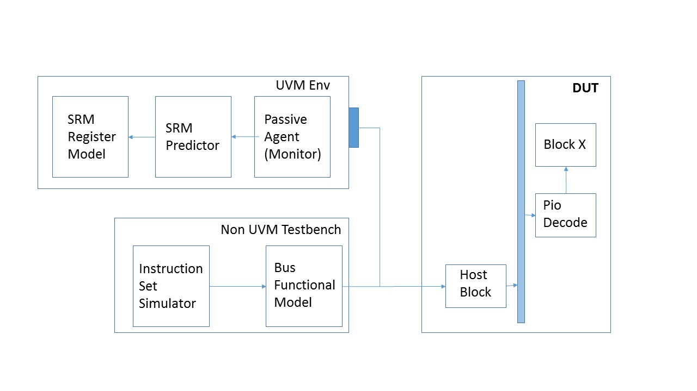

## UVM Testbench Active Mode
In active operation, the register access is sourced from the register model via the access API. These read and write operations on the register model are converted to generic bus transactions by the model. These are then forwarded to the selected bus adapter as per the configured adapter policy. The bus adapter chosen implements the actual conversion from the generic transaction to the specific bus transaction. Unlike UVM registers, even backdoor is implemented as a separate adapter rather than being a part of the register model. 
  
  This is shown below in Figure 1. Here the model has a handle to 3 adapters. The backdoor adapter may just use dpi to directly set/get the design flops. A frontdoor adapter instead would run the actual bus transaction to implement the transfer. A sidedoor adapter may skip the DUT host block and issue the access directly to the block’s local pio decoder.
  

Figure 1: UVM Testbench Active Mode 

## UVM Testbench Passive Mode 
For passive operation, the register access is not generated by the register model. This could be created by some other mechanism like embedded software, or a legacy non UVM environment but the model is still required to be accurate for the checks and functional coverage. 
In this case, a predictor is used to observe the bus transactions and then forward them to the SRM register model. An example of Instruction set simulator based test bench is shown below in Figure 2.

Figure 2: UVM Testbench Passive Mode 

